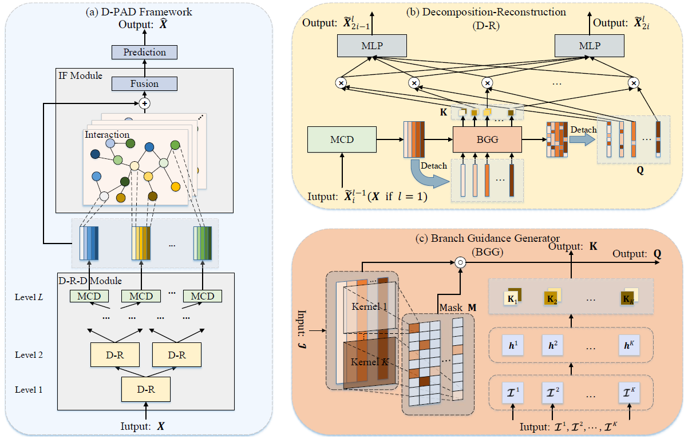
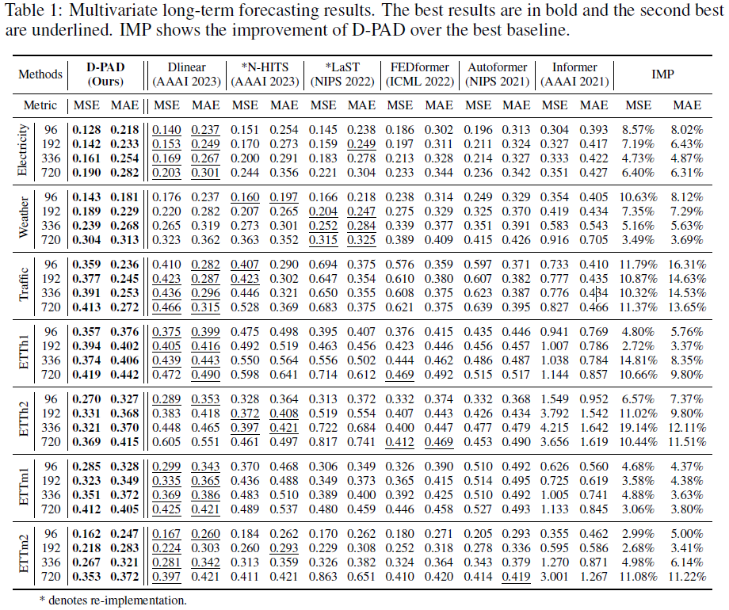

# D-PAD: Deep-Shallow Multi-Frequency Patterns Disentangling for Time Series Forecasting

This repository is the official implementation of D-PAD: Deep-Shallow Multi-Frequency Patterns Disentangling for Time Series Forecasting. 



## Requirements

To install requirements:

```setup
pip install -r requirements.txt
```

## Training

To train the model(s) in the paper, run this command:

```train
sh ./scripts/run_ECL.sh
sh ./scripts/run_ETTh1.sh
sh ./scripts/run_ETTh2.sh
sh ./scripts/run_ETTm1.sh
sh ./scripts/run_ETTm2.sh
sh ./scripts/run_traffic.sh
sh ./scripts/run_weather.sh
```

## Main Results



## Directory Structure

The code directory structure is shown as follows:

```
D-PAD
├── datasets  # seven datasets files
│	└── long
│       ├── ETTh1.csv
│       ├── ETTh2.csv
│       ├── ETTm1.csv
│       ├── ETTm2.csv
│       ├── ECL.csv
│       ├── traffic.csv
│       └── weather.csv
├── data_process  # data loading and preprocessing code
│   └── ETT_data_loader.py
├── experiments  # training, validation, and test code of D-PAD
│   ├── exp_basic.py
│   └── exp_ETT.py
├── layers	
│   ├── Attention.py
│   ├── GAT.py
│   ├── GCN.py
│   ├── MCD.py
│   └── SEBlock.py
├── model 	# LaST main code
│   ├── D_PAD_adpGCN.py
│   ├── D_PAD_ATT.py
│   ├── D_PAD_GAT.py
│   └── D_PAD_SEBlock.py
└── utils
│   ├── ETTh_metrics.py
│   ├── gumbel_softmax.py
│   ├── math_utils.py
│   ├── metrics.py
│   └── tools.py
├── run_long.py	   # original version (multi-card)
├── singlecard.py  # single card version
├── LICENSE     # code license
└── README.md   # This file
```
